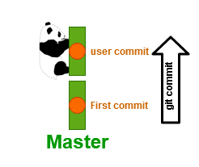
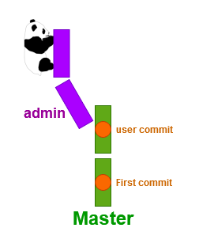
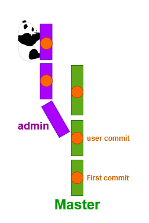
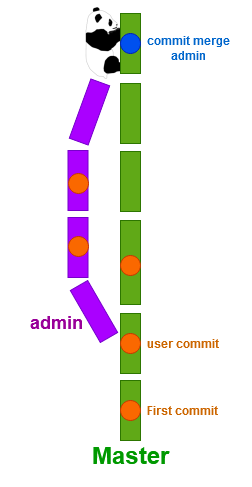
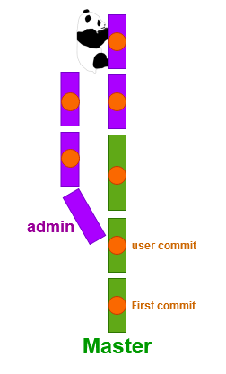

# GIT

Hey, this is my first tuto about Git !  
Let’s go discover Git and its environment.  
To begin, don't forget to install Git on your computer, on Windows I advise to choose **GitBash** software.  
For Linux no problem, Git is already installed.  
If you are prepared, you can start !

Before open a console, create an account on :octocat:Github, Bitbucket or Gitlab.  
Once the account is created, create a new <span style="color:#35d5b6;">repository</span> with the name : **tutogit**

## Lexicon

## <span style="color:#35d5b6;">Repository</span>
It represent in general a project. In your <span style="color:#35d5b6;">repository</span> we will find all files of your project.

## <span style="color:#1c6600;">Branch</span>

It represent a timeline of <span style="color:#8c00c0;">commit</span>.  
You can create many <span style="color:#1c6600;">branch</span> with many different versions of your project.  

  

On this schema the master <span style="color:#1c6600;">branch</span> contains three <span style="color:#8c00c0;">commits</span> or snapshot (A,B,C), the numbers above a snpashot is the reference of a <span style="color:#8c00c0;">commit</span>.  
Every <span style="color:#1c6600;">branch</span> has a pointer, your branch pointer can be before the end of your <span style="color:#1c6600;">branch</span>.  
In this schema the pointer of your <span style="color:#1c6600;">branch</span> is at the end.

### Two different visions

You can understand the concept of <span style="color:#1c6600;">branch</span> and its modelisation with two visions.  
Keep the best for you.

### Vision by pointer

We can visualize a <span style="color:#1c6600;">branch</span> like a pointer on <span style="color:#8c00c0;">commit</span>. Every <span style="color:#8c00c0;">commit</span> has a parent <span style="color:#8c00c0;">commit</span> so it's a chain of <span style="color:#8c00c0;">commit</span>.  
A <span style="color:#1c6600;">branch</span> is just the name of the pointer on this chain.

 

<br><br>

When you create another <span style="color:#1c6600;">branch</span> with git checbout -b, you create a new pointer on this <span style="color:#1c6600;">branch</span>.

 

In this example : git checkout -b testing

<br><br>

Git needs to know on wich <span style="color:#1c6600;">branch</span> / pointer you are, to know this you have a cursor name *HEAD*

 

In this example : you are on the <span style="color:#1c6600;">branch</span> testing, when you used git checkout, you moved your HEAD cursor.

<br><br>

When you work, you create new <span style="color:#8c00c0;">commits</span>, these <span style="color:#8c00c0;">commits</span> append at the end of your chain.

 

In this example : you had create a new <span style="color:#8c00c0;">commit</span> identified by *87ab2* on the testing <span style="color:#1c6600;">branch</span>. When you committed, your <span style="color:#1c6600;">branch</span> pointer and your cursor move to this <span style="color:#8c00c0;">commit</span>. But the other <span style="color:#1c6600;">branch</span> pointer stay where there are. So you can have <span style="color:#1c6600;">branch</span> pointer behind.  
Git pull bring back a pointer at the end of the chain.

<br><br>

If you would like come back to an old instant of your project, you can git checkout on a <span style="color:#1c6600;">branch</span> or a <span style="color:#8c00c0;">commit</span> identifier.

 

In this example : you had execute git checkout master  
If you had execute git checkout *f30ab*, your HEAD will not attached to a <span style="color:#1c6600;">branch</span> and you could not git pull for bring back master at the end. 

<br><br>

When you work with other people, each worker can create a new <span style="color:#1c6600;">branch</span> and <span style="color:#8c00c0;">commit</span> on it. That create a split in the chain. 

 

<br><br>

Once the job is done on a <span style="color:#1c6600;">branch</span>, we would like bring back this job on the master <span style="color:#1c6600;">branch</span>.  
To do this, we need to merge these branch with git merge.  
When git merges two <span style="color:#1c6600;">branchs</span>, it creates a new <span style="color:#8c00c0;">commit</span> (commit merge) who has two parents : 
- last <span style="color:#8c00c0;">commit</span> on master <span style="color:#1c6600;">branch</span>
- last <span style="color:#8c00c0;">commit</span> on own new <span style="color:#1c6600;">branch</span>

Becarefull this step can create some <span style="color:#c40813;">conflict</span>.  
A <span style="color:#1c6600;">branch</span> is juste a pointer on a <span style="color:#8c00c0;">commit</span> so if you delete the <span style="color:#1c6600;">branch</span>, doesn't matter your <span style="color:#8c00c0;">commit</span> still exist. But once the <span style="color:#1c6600;">branch</span> are delete, it's difficult to access to this <span style="color:#8c00c0;">commit</span>. 

 

In this example : we have merge the <span style="color:#1c6600;">branch</span> *iss53* in *master*
git merge iss53  
If in *C3*,*C4*,*C5* only diffent files are modified, you can't have a <span style="color:#c40813;">conflict</span>.  
But at the time where the same file is modified, you could have some conficts.

## Why rebase better than merge ?

Merge : 

 

Rebase :

 

### Readability

We have seen a merge create a new <span style="color:#8c00c0;">commit</span> and it referes to two parents.  
A rebase replay all <span style="color:#8c00c0;">commits</span> on the <span style="color:#1c6600;">branch</span> where we would like added our modifications.
In term of readability is better because we have all <span style="color:#8c00c0;">commits</span> in the chain and not a bag of <span style="color:#8c00c0;">commits</span> who refer another <span style="color:#8c00c0;">commits</span> chain. 

### Import branch

In some case we have a <span style="color:#1c6600;">branch</span> create from another <span style="color:#1c6600;">branch</span> like this schema

 

We have a <span style="color:#1c6600;">branch</span> server create from master and another <span style="color:#1c6600;">branch</span> client create from server.  
Problem : How import the <span style="color:#8c00c0;">commits</span> *C8* and *C9* ? 

The best way it's to replay only *C8* and *C9* at the end of the master <span style="color:#1c6600;">branch</span>.

 

In this exemple, we had execute git rebase client on the master <span style="color:#1c6600;">branch</span>.

### Vision by tree branch

You can see a git project like a tree with these <span style="color:#1c6600;">branchs</span>.  
The root of your tree is your first <span style="color:#8c00c0;">commit</span>.

 

In a git project the trunk of your tree is the master <span style="color:#1c6600;">branch</span>.  
A <span style="color:#1c6600;">branch</span> is composed by different type of <span style="color:#8c00c0;">commit</span> but every <span style="color:#8c00c0;">commit</span> grow your <span style="color:#1c6600;">branch</span>.
In this schema : 
- Blue and green dot : <span style="color:#8c00c0;">commit</span>
- Red and orange dot : checkout

When you create a git project with only one <span style="color:#8c00c0;">commit</span> you have this tree representation :

 

In our example we have a bamboo, the trunk is representend by the master <span style="color:#1c6600;">branch</span> in green, commits are represented by orange dot and the great panda represent our position in the project.  
Currently we are on the first <span style="color:#8c00c0;">commit</span>.

<br><br>

 

In this case we add a new feature *user*, we create a new commit *user commit*. 
Our bamboo grow with <span style="color:#8c00c0;">commits</span> and the panda follow our <span style="color:#8c00c0;">commits</span>.

<br><br>

It's possible to create different <span style="color:#1c6600;">branch</span> for working with other people.  
Each worker have one panda and can work on the same <span style="color:#1c6600;">branch</span> as you.

 

In our example we have create a new <span style="color:#1c6600;">branch</span> *admin* and it was create from *user commit*.  
We can see our panda doesn't have a <span style="color:#8c00c0;">commit</span> in fornt, because Git doesn't create a <span style="color:#8c00c0;">commit</span> when it create a <span style="color:#1c6600;">branch</span>.

<br><br>

When we would like work on several feature we can create many <span style="color:#1c6600;">branchs</span> with different <span style="color:#8c00c0;">commit</span> on it.

 

At this point, we would like come back the <span style="color:#8c00c0;">commits</span> from the admin <span style="color:#1c6600;">branch</span> on the master <span style="color:#1c6600;">branch</span>. 

 

The command git merge create a new <span style="color:#8c00c0;">commit</span> attached to our admin <span style="color:#1c6600;">branch</span>.  
If you delete the admin <span style="color:#1c6600;">branch</span>, you don't loose your <span style="color:#8c00c0;">commit</span>, you forget just how to come on.

<br><br>

You can also use git rebase to come back your features. The result is similar but gives a better overview of your project. The rebase replay your <span style="color:#8c00c0;">commit</span> on another <span style="color:#1c6600;">branch</span>.

 

## <span style="color:#8c00c0;">Commit</span>
 
It represent an instant of your project named also snapshot.   
Git store modifications by instant of project and not by difference.   
A <span style="color:#8c00c0;">commit</span> contains a tree of all modify files, an author, his name, his reference, his parent and some other metadata.  
A parent of <span style="color:#8c00c0;">commit</span> is the previous version of a <span style="color:#8c00c0;">commit</span>.

  

In this schema *98ca9* is the reference of the <span style="color:#8c00c0;">commit</span>.  
A <span style="color:#8c00c0;">commit</span> construct a tree of files references. In tree we find only the list of modifing files

To create a <span style="color:#8c00c0;">commit</span>, we may follow this three steps :  
1) Add files to the <span style="color:#8c00c0;">commit</span> tree where we would like save modifications (git add)
2) Name and save the <span style="color:#8c00c0;">commit</span> (git commit)
3) Push the <span style="color:#8c00c0;">commit</span> to our version manager platform (git push)

  

## <span style="color:#c40813;">Conflict</span>

A <span style="color:#c40813;">conflict</span> is a Git error, it appears when you try to merge two <span style="color:#1c6600;">branchs</span> and in these <span style="color:#1c6600;">branchs</span> you have modified the same file.  
Git can't find which file would you like to keep.  
To continue, you may resolve <span style="color:#c40813;">conflicts</span>.  

To know which files are in <span style="color:#c40813;">conflict</span> you can use git status :
```
$ git status
On branch master
You have unmerged paths.
  (fix conflicts and run "git commit")

Unmerged paths:
  (use "git add <file>..." to mark resolution)

    both modified:      index.html

no changes added to commit (use "git add" and/or "git commit -a")
```
In this example, index.html is in <span style="color:#c40813;">conflict</span>.  
*both modfied* means this file is modified on the both <span style="color:#1c6600;">branch</span>.  

To fix a <span style="color:#c40813;">conflict</span> you may open files in <span style="color:#c40813;">conflict</span> and change inside lines you would keep or remove.  

In file, <span style="color:#c40813;">conflicts</span> are always marked with the following syntax :

```
<<<<<<< HEAD:file
code of the branch where you are
======
code of the branch that you want merge
>>>>>>> branch_to_merge:file
```

You may choose between the first part and the second part.  
Some tools and editors can help you to fix more quickly.  


```
<<<<<<< HEAD:index.html
<div id="footer">contact : email.support@github.com</div>
======
<div id="footer">
 please contact us at support@github.com
</div>
>>>>>>> iss53:index.html
```

In this example, we would like to merge *iss53* in *master* but we have a <span style="color:#c40813;">conflict</span> in *index.html*.  

## Command Git

## <span style="color:#fa7811;">git status</span>
Display the state of your git project

```
git status
```
The following response is the simplest response
```
On branch master
Your branch is up to date with 'origin/master'.

nothing to commit, working tree clean
```

We will look line by line this response :  
1) *On branch master*  
   Git indicated you are on a <span style="color:#1c6600;">branch</span> named *master*
2) *Your branch is up to date with 'origin/master'.*  
   It indicated the exact state of your <span style="color:#1c6600;">branch</span>  
   *origin* represent your version manager platform  
   *origin/master* represent the <span style="color:#1c6600;">branch</span> with the name *master* in your version manager platform  
3) *nothing to commit, working tree clean*  
   Nothing to <span style="color:#8c00c0;">commit</span> means you are any modify files  
   Working tree clean means the same things in this case
   

If you aren't in a git project the following error will be display
```error
fatal: not a git repository (or any of the parent directories): .git
```

## <span style="color:#fa7811;">git clone</span>
Download your <span style="color:#35d5b6;">repository</span> where you are with your console  

```
 git clone url_of_my_project
```

For example if you would like download this project you can execute :

```
 git clone https://github.com/SamuelPelletier/tuto-Git.git
```

## <span style="color:#fa7811;">git add</span>
Add file in a <span style="color:#8c00c0;">commit</span>.

```
git add /path/to/filename
```

A usefull option of this command is all.  
Add all files who are modified or untracked.
```
git add -A
```

## <span style="color:#fa7811;">git commit</span>

Close and named the commit.  
When the commit is closed, git add command appends file in a new commit.

```
git commit -m"my commit title"
```

## <span style="color:#fa7811;">git push</span>

Send all commits to our version manager platform.  

```
git push
```
## <span style="color:#fa7811;">git pull</span>

Get all new commits from your version manager platform. 

```
git pull
```

Becarefull you can't pull if you are some files not committed.

## <span style="color:#fa7811;">git merge</span>

Merge a branch with another branch. the branch where you are will be merge with the branch in parameter.

```
git merge my_branch
```

Becarefull you can rise <span style="color:#c40813;">conflicts</span>.

## <span style="color:#fa7811;">git rebase</span>

Replay all commits of a branch on another branch.  
The result of this command is like git merge.

```
git rebase branch_to_bring_back
```

Becarefull you can rise <span style="color:#c40813;">conflicts</span>.

<br><br><br><br>
For the Windows guys : 
- Right click on your desktop
- Choose **Git Bash Here**

For the Linux player : 
- Just open a command line

From here it's the same work if you are pro Windows or a Linux priest :pray:

We will import your <span style="color:#35d5b6;">repository</span> with the follwing command

```
git clone my_git_repo_url
```
Nice you have write your first git command ! 🎉

Let's go in this great folder 
```
cd tutogit
```

You have just download a git project, now we can begin to manage our git project.  
You can note you have already a folder name *.git*. This folder store all your modify in your git project.

We will configure our username and our email
```
git config --global user.name "my_username"
```
```
git config --global user.email "my@email.com"
```
We can check our repository with git status
```
git status
```

We will create a new file in our folder.
```
touch index.html
```

We will try again git status for see the difference.
```
git status
```
We will be interested in this response to the previous one.

```
Untracked files:
  (use "git add <file>..." to include in what will be committed)

        index.html

nothing added to commit but untracked files present (use "git add" to track)
```

Git tells us we have an untracked file named *index.html*.  
It says too, *nothing added to commit* this sentence means our <span style="color:#8c00c0;">commit</span> is empty.  
But it advises *use "git add \<file>..." to include in what will be committed*.  
In order to save the creation of our index.html, we must use the command advise and below.

In our case we add only *index.html* you can execute one of the following command :  

```
git add index.html
```
or
```
git add -A
```
<br>

We will check the new git status  
```
git status
```
You should get this response
```
Changes to be committed:
  (use "git reset HEAD <file>..." to unstage)

        new file:   index.html
```

We observe *index.html* is in *Changes to be comitted* so *index.html* is in the file list will be send to our version manager platform  
Git informs us that we can rollback our git add with git reset, we will see this command after.

Now we have one file in our commit but the commit is open yet.  
We need to close the commit for send it to our version manager platform  

In our case we create our first commit
```
git commit -m'First commit with index.html'
```

We will send our new creation file to our version manager platform  
```
git push
```

