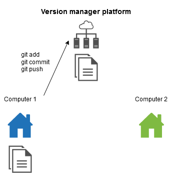
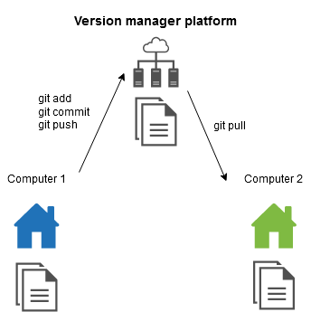

# GIT

Hey, this is my first tuto about Git !  
Let’s discover Git and its environment.  
To begin, don't forget to install Git on your computer, on Windows I advise to choose **GitBash** software.  
For Linux no problem, Git is already installed.  
If you are prepared, you can start !

Before open a console, create an account on :octocat:Github, Bitbucket or Gitlab.  
Once the account is created, create a new repository with the name : **tutogit**

## Lexicon

## Repository

It represent in general a project. In your repository we will find all files of your project.

## Branch

It represent a timeline of commit.  
You can create many branch with many different versions of your project.  

  

On this schema the master branch contains three commits or snapshot (A,B,C), the numbers above a snpashot are the identifier.  

### Two different visions

You can understand the concept of branch with two visions.  
Keep the best for you.

### Vision by pointer

In this version a branch is a pointer (ex: Master) on a commit.  
Every commit have a parent who is a commit so it's a chain of commit.  
A branch is just the name of the pointer on this chain.

 

<br><br>

When you create another branch with git checbout -b, you create a new pointer on this branch.

 

In this example : git checkout -b testing

<br><br>

Git needs to know on wich branch / pointer you are, to know this you have a cursor name *HEAD*.  
You can move on different branches beacuse you are represented by a pointer who reference in general a branch.

 

In this example : you are on the branch testing, when you used git checkout, you moved your HEAD cursor.  


<br><br>

When you work, you create newcommits, these commits append at the end of your chain.

 

In this example : you had create a new commit identified by *87ab2* on the testing branch. When you committed, your branch pointer and your cursor move to this commit. But the other branch pointer stay where there are. So you can have branch pointer behind.  
Git pull bring back a pointer at the end of the chain.

<br><br>

If you would like come back to an old instant of your project, you can git checkout on a branch or a commit.

 

In this example : you had execute git checkout master  
If you had execute git checkout *f30ab*, your HEAD will not attached to a branch and you could not git pull for bring back master at the end. 

<br><br>

When you work with other people, each worker can create a branch and commit on it. That create a split in the chain. 

 

<br><br>

Once the job is done on a branch, we would like bring back this job on the master branch.  
To do this, we need to merge these branch with git merge command.  
When git merges two branchs, it creates a new commit (commit merge) who has two parents : 
- last commit on master branch
- last commit on own new branch

Becarefull this step can create some conflict.  
A branch is juste a pointer on a commit so if you delete the branch, doesn't matter your commit still exist. But once the branch are delete, it's difficult to access to this commit. 

 

In this example : we have merge the branch *iss53* in *master*
git merge iss53  
If in *C3*,*C4*,*C5* only diffent files are modified, you can't have a conflict.  
But if the same file is modified, you could have some conficts.

## Why rebase better than merge ?

Merge : 

 

Rebase :

 

### Readability

We have seen a merge create a commit and it referes to two parents.  
A rebase replay all commits on the branch from another branch.
In term of readability is better because we have all commits in the chain and not a bag of commits who refer another commits chain. 

### Import branch

In some case we have a branch create from another branch like this schema

 

We have a branch server create from master and another branch client create from server.  
Problem : How import the commits *C8* and *C9* ? 

The best way it's to replay only *C8* and *C9* at the end of the master branch.

 

In this exemple, we had execute git rebase client on the master branch.

### Vision by tree branch

You can see a git project like a tree with these branchs.  
The root of your tree is your first commit.

 

In a git project the trunk of your tree is the master branch.  
A branch is composed by different commits who grow your branch.
In this schema : 
- Blue and green dot : commit
- Red and orange dot : checkout

When you create a git project with only one commit you have this tree representation :

 

In our example we have a bamboo, the trunk is representend by the master branch in green, commits are represented by orange dot and the great panda represent our position in the project.  
Currently we are on the first commit.

<br><br>

 

In this case we add a new feature *user*, we create a commit *user commit*. 
Our bamboo grow with commits and the panda follow our commits.

<br><br>

It's possible to create different branch for working with other people.  
Each worker have one panda and can work on the same branch as you.

 

In our example we have create a branch *admin* and it was create from *user commit*.  
We can see our panda doesn't have a commit in front, because Git doesn't create a commit when it create a branch.

<br><br>

When we would like work on several feature we can create many branchs with different commit on it.

 

At this point, we would like bring back the commits from the admin branch on the master branch. 

 

The command git merge create a commit attached to our admin branch.  
If you delete the admin branch, you don't loose your commit, you forget just how to come on.

<br><br>

You can also use git rebase to bring back your features. The result is similar but gives a better overview of your project. The rebase copy your commit at the end of another branch.

 

## Commit
 
It represent an instant of your project named also snapshot.   
Git store modifications by instant of project and not by difference.   
A commit contains a tree of all modify files, an author, his name, his reference, his parent and some other metadata.  
A parent of commit is the previous version of a commit.

  

In this schema *98ca9* is the reference of the commit.  

To create a commit, we may follow this three steps :  
1) Add files to the commit tree where we would like save modifications (git add)
2) Name and save the commit (git commit)
3) Push the commit to our version manager platform (git push)

  

## Conflict

A conflict is a Git error, it appears when you try to merge two branchs and in these branchs you have modified the same file.  
Git can't find which file would you like to keep.  
To continue, you may resolve conflicts.  

To know which files are in conflict you can use git status :
```
$ git status
On branch master
You have unmerged paths.
  (fix conflicts and run "git commit")

Unmerged paths:
  (use "git add <file>..." to mark resolution)

    both modified:      index.html

no changes added to commit (use "git add" and/or "git commit -a")
```
In this example, index.html is in conflict.  
*both modfied* means this file is modified on the both branch.  

To fix a conflict you may open files in conflict and change inside lines you would keep or remove.  

In file, conflicts are always marked with the following syntax :

```
<<<<<<< HEAD:file
code of the branch where you are
======
code of the branch that you want merge
>>>>>>> branch_to_merge:file
```

You may choose between the first part and the second part.  
Some tools and editors can help you to fix more quickly.  


```
<<<<<<< HEAD:index.html
<div id="footer">contact : email.support@github.com</div>
======
<div id="footer">
 please contact us at support@github.com
</div>
>>>>>>> iss53:index.html
```

In this example, we would like to merge *iss53* in *master* but we have a conflict in *index.html*.  

## Gitignore

## Command Git

## git status
Display your state and the state of your place (commit, branch)

```
git status
```
The following response is the simplest response.  
```
On branch master
Your branch is up to date with 'origin/master'.

nothing to commit, working tree clean
```

We will look line by line this response :  
1) *On branch master*  
   Git indicated you are on a branch named *master*
2) *Your branch is up to date with 'origin/master'.*  
   It indicated the exact state of your branch  
   *origin* represent your version manager platform  
   *origin/master* represent the branch with the name *master* in your version manager platform  
3) *nothing to commit, working tree clean*  
   This sentence means you are any modify files  
   

If you aren't in a git project the following error will be display
```error
fatal: not a git repository (or any of the parent directories): .git
```

## git clone
Download your repository  

```
 git clone url_of_my_project
```

For example if you would like download this project you can execute :

```
 git clone https://github.com/SamuelPelletier/tuto-Git.git
```

## git add
Add file in a commit.

```
git add /path/to/filename
```

A usefull option of this command is all.  
Add all files who are modified or untracked.
```
git add -A
```

## git commit

Close and named the commit.  
When a commit is closed, git add command appends file in a new commit.

```
git commit -m"my commit title"
```

## git push

Send all commits to our version manager platform.  

```
git push
```

## git fetch

Get all new commits from your version manager platform. 

```
git fetch
```

## git pull

Get all new commits from your version manager platform and merge with the branch. 

```
git pull
```

Becarefull you can't pull if you are some files not committed.

## git checkout

Change your position to another branch or a commit.

```
git checkout my_branch
```
```
git checkout id_commit
```

If you add -b parameter, you create a new branch

```
git checkout -b my_branch
```

## git merge

Merge a branch with another branch. The branch where you are will be merge with the branch in parameter.

```
git merge my_branch
```

Becarefull you can rise conflicts.

## git rebase

Replay all commits of a branch at the end of another branch.  
The result of this command is like git merge.

```
git rebase branch_to_bring_back
```

<br><br><br><br>

# Tutoriel

For the Windows guys : 
- Right click on your desktop
- Choose **Git Bash Here**

For the Linux player : 
- Just open a command line

From here it's the same work if you are pro Windows or a Linux priest :pray:

We will import your repository with the following command

```
git clone my_git_repo_url
```
Nice you have write your first git command ! 🎉

Let's go to your great folder 
```
cd tutogit
```

You have just download a git project, now we can begin to manage our git project.  
You can note you have already a folder name *.git*. This folder store all your modify in your git project.

We will configure our username and our email
```
git config --global user.name "my_username"
```
```
git config --global user.email "my@email.com"
```
We can check our repository with git status
```
git status
```

We will create a new file in our folder.
```
touch index.html
```

We will try again git status for see the difference.
```
git status
```
We will be interested in this response to the previous one.

```
Untracked files:
  (use "git add <file>..." to include in what will be committed)

        index.html

nothing added to commit but untracked files present (use "git add" to track)
```

Git tells us we have an untracked file named *index.html*.  
If you have a colorated console, you can note index.html is in red, red means your file isn't in a commit.   
It says too, *nothing added to commit* this sentence means our commit is empty.  
But it advises *use "git add \<file>..." to include in what will be committed*.  
In order to save the creation of our index.html, we must use the command advise and below.

In our case we add only *index.html* you can execute one of the following command :  

```
git add index.html
```
or
```
git add -A
```
<br>

We will check the new git status  
```
git status
```
You should get this response
```
Changes to be committed:
  (use "git reset HEAD <file>..." to unstage)

        new file:   index.html
```

We observe *index.html* is in *Changes to be comitted* so *index.html* is in the file list will be send to our version manager platform, its color change to green for represent your file in a commit  
Git informs us that we can rollback our git add with git reset, we will see this command after.

Now we have one file in our commit but the commit is open yet.  
We may close the commit to send it to our version manager platform  

In our case we create our first commit
```
git commit -m'First commit with index.html'
```

We will send our new creation file to our version manager platform  
```
git push
```

Just with the commands before you can work alone on your one compture. 😢  

If you would like work on a git project alone but on many computer you have needed the following command :  
```
git pull
```

Before you start worked on another computer, you may use this command to get back your code on this computer.  

Step 1 : Code on your first computer  


<br><br>

Step 2 : Send your code to your version manager platform  


<br><br>

Step 3 : Get back your code on your second computer for work   


<br><br>

Now you have found a friend to work with you.  
No problem, we will create two branchs, one for you and one for your friend.  
If you haven't a friend we will simulate one.  
  
I present you :  
<br>

  

The Companion Cube !  

"*This Weighted Companion Cube will accompany you. Please take care of it.*"
<br>

```
git checkout -b my_branch
```
```
git checkout -b my_companion_cube_branch
```

You are on the companion cube branch, we will simulate a collaborative work.  

```
touch companion_cube.html
```
```
git add -A
```
```
git commit -m'Add companion cube page'
```
```
git push
```

<br>

Now we will return on your branch and get back the modifications create by your new friend.  
```
git checkout my_branch
```

We will use git merge to merge your friend branch into your branch.  

```
git merge my_companion_cube_branch
```

Now your branch is at the same progress as your friend.  

It was easy but it's not always the case. We will see conflicts.  

We will write something in our file :  
```
echo "add some text" >> index.html
```
```
git add -A
```
```
git commit -m'Add text in index.html'
```
```
git push
```
```
git checkout my_companion_cube_branch
```
```
rm index.html;touch index.html; echo "add some cube text" >> index.html
```
```
git add -A
```
```
git commit -m'Add text in index.html'
```
```
git push
```

We will try to merge these two branchs like before.
```
git merge my_branch
```
```
Auto-merging index.html
CONFLICT (add/add): Merge conflict in index.html
Automatic merge failed; fix conflicts and then commit the result.
```

Check the status of your branch :  
```
git status
```
```
On branch my_companion_cube_branch
Your branch is ahead of 'origin/my_companion_cube_branch' by 1 commit.
  (use "git push" to publish your local commits)

You have unmerged paths.
  (fix conflicts and run "git commit")
  (use "git merge --abort" to abort the merge)

Unmerged paths:
  (use "git add <file>..." to mark resolution)

        both added:      index.html

no changes added to commit (use "git add" and/or "git commit -a")
```

You may resolve the conflict to continue.  

Once the conflict is fixed, add your modification to the commit : 
```
git add -A
```
or 
```
git add -index.html
```

Close the commit with :  
```
git commit
```

When Vim editor opens juste press enter or you can left with *:q*.  

